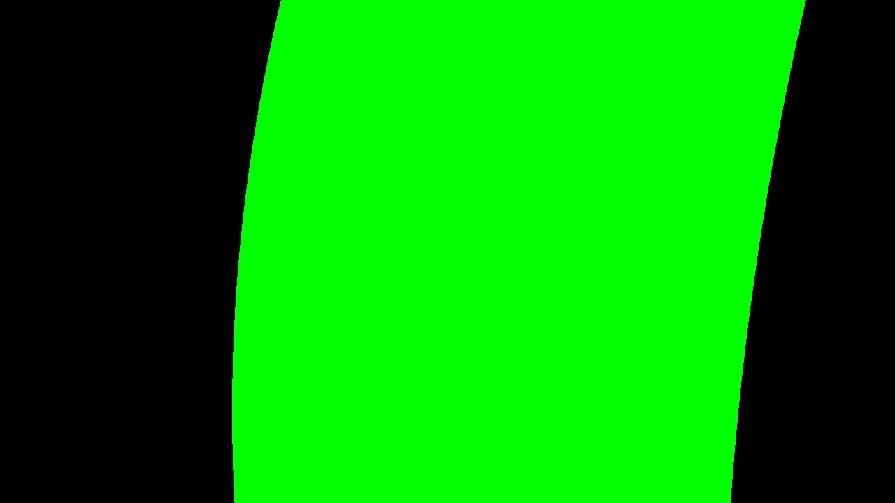

**Advanced Lane Finding Project**

The goals / steps of this project are the following:

* Compute the camera calibration matrix and distortion coefficients given a set of chessboard images.
* Apply a distortion correction to raw images.
* Use color transforms, gradients, etc., to create a thresholded binary image.
* Apply a perspective transform to rectify binary image ("birds-eye view").
* Detect lane pixels and fit to find the lane boundary.
* Determine the curvature of the lane and vehicle position with respect to center.
* Warp the detected lane boundaries back onto the original image.
* Output visual display of the lane boundaries and numerical estimation of lane curvature and vehicle position.

[//]: # (Image References)

[image1]: ./examples/undistort_output.png "Undistorted"
[image2]: ./test_images/test1.jpg "Road Transformed"
[image3]: ./examples/binary_combo_example.jpg "Binary Example"
[image4]: ./examples/warped_straight_lines.jpg "Warp Example"
[image5]: ./examples/color_fit_lines.jpg "Fit Visual"
[image6]: ./examples/example_output.jpg "Output"


### Writeup / README

#### 1. Provide a Writeup / README that includes all the rubric points and how you addressed each one.  You can submit your writeup as markdown or pdf.  [Here](https://github.com/udacity/CarND-Advanced-Lane-Lines/blob/master/writeup_template.md) is a template writeup for this project you can use as a guide and a starting point.  

You're reading it!

### Camera Calibration

#### 1. Briefly state how you computed the camera matrix and distortion coefficients. Provide an example of a distortion corrected calibration image.

The code for the camera calibration is located in the function ```find_chessboard_corners()```.

Here, I started to prepare "object points", which reflect the corner points in a 3D world. I am assuming that the chesssboard is fixed on the [x|y] pane at z = 0. So the different calibration images will share the same objects points.
Afterwards I detect the chessboard corners in the different images, the OpenCV function ```findChessboardCorner()``` is extracting that information from the image. If this was successful, I add both the object points and the corner points for every particular image to an array and fit the camera calibration data by using OpenCV's ```calibrateCamera```.
It will give me the needed calibration matrix to undistort the raw camera image.

Original chessboard calibration image:


Undistorted chessboard calibration image:


### Pipeline (single images)

#### 1. Provide an example of a distortion-corrected image.

With the calibration matrix I've got with the calibration images, I can undistort the camera image:


Raw image:


#### 2. Describe how (and identify where in your code) you used color transforms, gradients or other methods to create a thresholded binary image.  Provide an example of a binary image result.

I used a combination of color and gradient thresholds to generate a binary image. The combination ensures that we find the lanes wheter the lighting or the lane color changes / is different. Here is an example:

![Binary image of a combined color and gradient threshold][./output_images/straight_lines1.jpg_13_combined_color_gradient.jpg]

#### 3. Describe how (and identify where in your code) you performed a perspective transform and provide an example of a transformed image.

The code for my perspective transform includes a function called `warper()`, which appears in lines 1 through 8 in the file `example.py` (output_images/examples/example.py) (or, for example, in the 3rd code cell of the IPython notebook).  The `warper()` function takes as inputs an image (`img`), as well as source (`src`) and destination (`dst`) points.  I chose the hardcode the source and destination points in the following manner:

```python
source = np.float32([
    (x_offset, img_size[0]),
    (x_center - 54, 450),
    (x_center + 54, 450),
    (img_size[1] - x_offset, img_size[0])
])
destination = np.float32([
    (x_offset, img_size[1]),
    (x_offset, 0),
    (img_size[0] - x_offset, 0),
    (img_size[0] - x_offset, img_size[1])
])
```

This resulted in the following source and destination points:

| Source        | Destination   | 
|:-------------:|:-------------:| 
| 585, 460      | 320, 0        | 
| 203, 720      | 320, 720      |
| 1127, 720     | 960, 720      |
| 695, 460      | 960, 0        |

I verified that my perspective transform was working as expected by drawing the `source` and `destination` points onto a test image and its warped counterpart to verify that the lines appear parallel in the warped image.

#### 4. Describe how (and identify where in your code) you identified lane-line pixels and fit their positions with a polynomial?

With the transformed binary image, I am able to detect the lines. Therefore, I use the "sliding window" technique. As a result, I know which pixels matter (= which pixels represent the lane-lines) and I'm able to fit a polynomial. The following image demonstrate the recognized "windows":


#### 5. Describe how (and identify where in your code) you calculated the radius of curvature of the lane and the position of the vehicle with respect to center.

With the fitted polynomials (left and right lane-line), I can also calculate further stuff, e.g. the radius of the lane-lines.
I can calculate this for a given point in the polynomials (see https://www.intmath.com/applications-differentiation/8-radius-curvature.php), I use the closest point to the car.

Additionaly, if we assume that the camera in the car is centered correctly, we know that the center of both lanes should also be the horizontal center of the image.

#### 6. Provide an example image of your result plotted back down onto the road such that the lane area is identified clearly.

As a last step, I can fill the area between both lane lines, still in the transformed image:



We can then transform this image back into the original image size, with the calibration data of the beginning. As an overlay of the input image, this is the result:

![final result][./output_images/straight_lines2.jpg_16_unwarped.jpg]


### Pipeline (video)

#### 1. Provide a link to your final video output.  Your pipeline should perform reasonably well on the entire project video (wobbly lines are ok but no catastrophic failures that would cause the car to drive off the road!).

Here's a [link to my video result](./output_videos/project_video.mp4)


### Discussion

#### 1. Briefly discuss any problems / issues you faced in your implementation of this project.  Where will your pipeline likely fail?  What could you do to make it more robust?

I implemented an improvement to the sliding window algorithm, where I don't calculate the complete line again. I just calculate the window for the top-located, new part of the image.

The current detection has a problem to identify the lane-line at specific amount of distance to the car. There is a drawback between a robust lane-line detection and the lane length we can detect, especially if the conditions change (e.g. lighting, ground color, less contrast).
