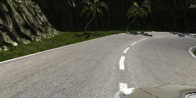
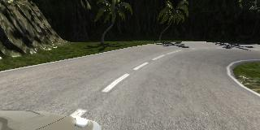
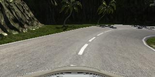

#**Behavioral Cloning** 

---

**Behavioral Cloning Project**

The goals / steps of this project are the following:
* Use the simulator to collect data of good driving behavior
* Build, a convolution neural network in Keras that predicts steering angles from images
* Train and validate the model with a training and validation set
* Test that the model successfully drives around track one without leaving the road
* Summarize the results with a written report


[//]: # (Image References)

[image1]: ./examples/placeholder.png "Model Visualization"
[image3]: ./examples/left.jpg "left-based camera"
[image4]: ./examples/center.jpg "center-based camera"
[image5]: ./examples/right.jpg "right-based camera"

## Rubric Points
###Here I will consider the [rubric points](https://review.udacity.com/#!/rubrics/432/view) individually and describe how I addressed each point in my implementation.  

---
###Files Submitted & Code Quality

####1. Submission includes all required files and can be used to run the simulator in autonomous mode

My project includes the following files:
* model.py containing the script to create and train the model
* drive.py for driving the car in autonomous mode
* model.h5 containing a trained convolution neural network 
* writeup_report.md or writeup_report.pdf summarizing the results

####2. Submission includes functional code
Using the Udacity provided simulator and my drive.py file, the car can be driven autonomously around the track by executing 
```sh
python drive.py model.h5
```

####3. Submission code is usable and readable

The model.py file contains the code for training and saving the convolution neural network. The file shows the pipeline I used for training and validating the model, and it contains comments to explain how the code works.

###Model Architecture and Training Strategy

####1. An appropriate model architecture has been employed

My first model used the well-known LeNet architecture. To minimize the loss, I experimented with the architecture provided by Nvidia. It uses multiple convolutional layers in combination with dropouts, which provide better results than the LeNet architecture.

The model also consists of two pre-processing steps: one the normalize the data and one for cropping the upper part of the camera pictures.

####2. Attempts to reduce overfitting in the model

The model contains dropout layers in order to reduce overfitting (model.py lines 86 & 88). 

The model was trained and validated on different data sets to ensure that the model was not overfitting (code line 97). The model was tested by running it through the simulator and ensuring that the vehicle could stay on the track.

####3. Model parameter tuning

The model used an adam optimizer, so the learning rate was not tuned manually (model.py line 105).

####4. Appropriate training data

Training data was chosen to keep the vehicle one the read. I combined data center lane driving and recovering from the left or right sides to the road. This helped the model to train, at the same time, the optimal line and recovering once something is going wrong.

###Model Architecture and Training Strategy

####1. Solution Design Approach

As discribed before, an architecture of Nvidia was choosen after first experiments with the LeNet architecture.
Together with the debug message from Keras about training & validation loss for every epoch, I could have seen very good, how the loss changed for every epoch, with a growing data set and the two different models.

It is also noticable that the pre-processing and the 3 different camera angles helped the model a lot to reduce the loss.

The final step was to run the simulator to see how well the car was driving around track one. There were a few spots where the vehicle fell off the track and choosed the off-road track. I then recorded the recovery data and data on the second track, which improved the behaviour in the hard situations.

At the end of the process, the vehicle is able to drive autonomously around the track without leaving the road.

####2. Final Model Architecture

The final model architecture (model.py lines 81-93) consisted of a convolution neural network with the following layers and layer sizes:

* normalization
* convolutional layer (24 filter with 5x5 size)
* convolutional layer (36 filter with 5x5 size)
* convolutional layer (48 filter with 5x5 size)
* convolutional layer (64 filter with 3x3 size)
* dropout layer with the propability of 0.3
* convolutional layer (64 filter with 3x3 size)
* dropout layer with the propability of 0.3
* flatten layer
* fully-connected layer with output size 100
* fully-connected layer with output size 50
* fully-connected layer with output size 1

####3. Creation of the Training Set & Training Process





To capture good driving behaviour, I drove multiple laps in both directions. Afterwards, I did "recovery" recordings, where I drove from the left and right to the center again. This was especially needed on the bridge: in the beginning, the model had trouble with the ground and borders, which are different to the rest of the track.

A good step was also to collect data on the second track. Even the second track has a extra line in the center, the model was able to recognize this not as an border. Together with the architectural improvements, I was finally able to drive a complete lap without losing track.

Very helpful were also the statistics of Keras after every epoch. I could clearly identify when the model was overfitting and if my changes improved the situation.
