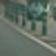
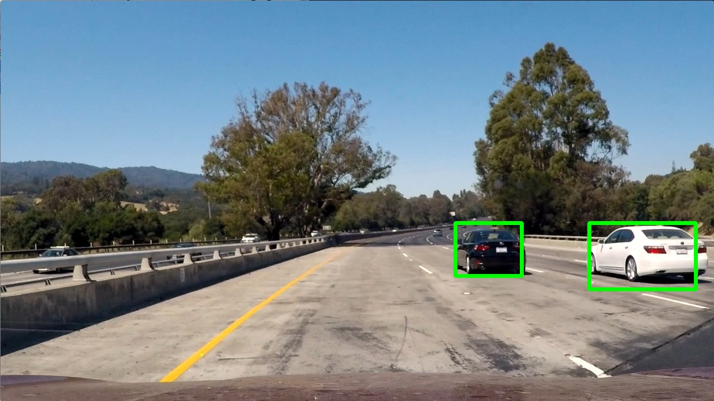
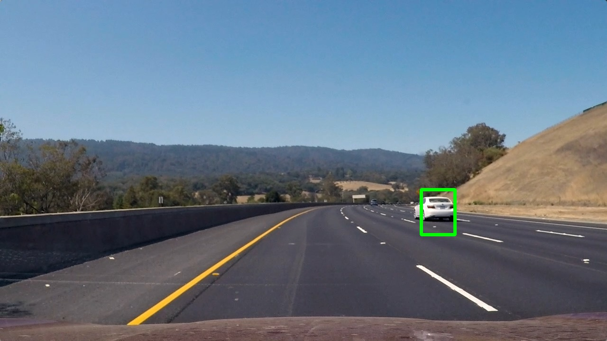
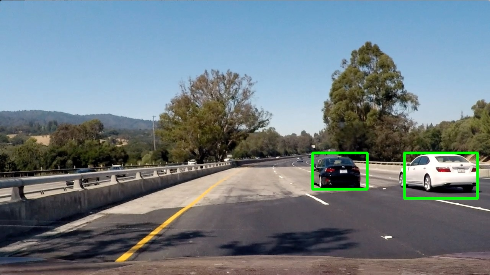

**Vehicle Detection Project**

The goals / steps of this project are the following:

* Perform a Histogram of Oriented Gradients (HOG) feature extraction on a labeled training set of images and train a classifier Linear SVM classifier
* Optionally, you can also apply a color transform and append binned color features, as well as histograms of color, to your HOG feature vector. 
* Note: for those first two steps don't forget to normalize your features and randomize a selection for training and testing.
* Implement a sliding-window technique and use your trained classifier to search for vehicles in images.
* Run your pipeline on a video stream (start with the test_video.mp4 and later implement on full project_video.mp4) and create a heat map of recurring detections frame by frame to reject outliers and follow detected vehicles.
* Estimate a bounding box for vehicles detected.

[//]: # (Image References)
[image1]: ./examples/car_not_car.png
[image2]: ./examples/HOG_example.jpg
[image3]: ./examples/sliding_windows.jpg
[image4]: ./examples/sliding_window.jpg
[image5]: ./examples/bboxes_and_heat.png
[image6]: ./examples/labels_map.png
[image7]: ./examples/output_bboxes.png
[video1]: ./project_video.mp4

### Writeup / README

#### 1. Provide a Writeup / README that includes all the rubric points and how you addressed each one.  You can submit your writeup as markdown or pdf.  [Here](https://github.com/udacity/CarND-Vehicle-Detection/blob/master/writeup_template.md) is a template writeup for this project you can use as a guide and a starting point.  

You're reading it!

### Histogram of Oriented Gradients (HOG)

#### 1. Explain how (and identify where in your code) you extracted HOG features from the training images.

The code for this step is contained in the function `extract_features()` in file `detect_vehicles.py`.
Before, I can use this function, I have to read in the different images for vehicles and non-vehicles.

Example for the vehicle class:


Example for the non-vehicle class:


I then explored different color spaces and different `skimage.hog()` parameters (`orientations`, `pixels_per_cell`, and `cells_per_block`).  I grabbed random images from each of the two classes and displayed them to get a feel for what the `skimage.hog()` output looks like.

Here is an example using the `YCrCb` color space and HOG parameters of `orientations=9`, `pixels_per_cell=(8, 8)` and `cells_per_block=(2, 2)`:



#### 2. Explain how you settled on your final choice of HOG parameters.

I trained a SVM with 80% of the data for vehicles and non-vehicles. 20% of the data was used for testing purpose.
With this, I could verified which parameters are the best for choosing between the two classes. In the end, I got a accuracy of 99.3%.

#### 3. Describe how (and identify where in your code) you trained a classifier using your selected HOG features.

I trained a linear SVM with both vehicle and non-vehicle data. The complete data set was shuffled and 20% were kept for testing.
The central place for extracting the features out of the images is `extract_features()` in `detect_vehicles.py`. The different features were identified:

* spatial binning
* color histogram
* HOG

With the combination of those three features, I got the best accuracy for detecting vehicles/non-vehicles.

### Sliding Window Search

#### 1. Describe how (and identify where in your code) you implemented a sliding window search.  How did you decide what scales to search and how much to overlap windows?

I used the sliding window technique to go through the image and identify vehicles.

At the beginning, I just searched with one scale of 1.5. I noticed that this worked very good for smaller cars, but not for `big` cars, which are very near.
So, I introduced a second and a third searching try for the scale of 2.5 & 3.5 and combined both results.



#### 2. Show some examples of test images to demonstrate how your pipeline is working.  What did you do to optimize the performance of your classifier?

As discussed before, I used the HOG features together with spatially binned color and color hisotgrams for the features vector.
Additionally, I did two `identification cycles` with different scales and applied a threshold for elimiating false positives.



### Video Implementation

#### 1. Provide a link to your final video output.  Your pipeline should perform reasonably well on the entire project video (somewhat wobbly or unstable bounding boxes are ok as long as you are identifying the vehicles most of the time with minimal false positives.)

Here's a [link to my video result](./output_videos/project_video.mp4)

#### 2. Describe how (and identify where in your code) you implemented some kind of filter for false positives and some method for combining overlapping bounding boxes.

The challenge and also the benefit of a video is, that you have a series of images. I used the advantage to implement a smoothing for identify the vehicles. Therefore, I store the 10 last heatmaps and sum it with the current heatmap.
This helped me to filter out false positives again with a threshold over the smoothed heatmap.

I then used `scipy.ndimage.measurements.label()` (like for a single test image) to identify individual blobs in the heatmap. Before doing this, I `normalized` the heat to 1, because `label()` is grouping the blobs by quantity / intensity.

```
...
heatmap[heatmap <= heatmap_threshold] = 0
heatmap[heatmap >= 1] = 1
...
```

### Discussion

#### 1. Briefly discuss any problems / issues you faced in your implementation of this project.  Where will your pipeline likely fail?  What could you do to make it more robust?

The pipeline works in general, but I see three major possibilties how I could improve the quality of the vehicle detection:

* train with a bigger training set: I could use other labeled sources for training. This could improve the accuracy of the SVM.
* use the acceleration of the vehicles: I could track the acceleration of the vehicles to use it in the next frame. I won't have to search in the complete image for features which would speed-up the pipeline a lot.
* don't through away the vehicle bounds: currently the boxes are very wobbly, because I calculate the box size for every frame. I could store the last x box sizes for an object and mean them for the next frame.
